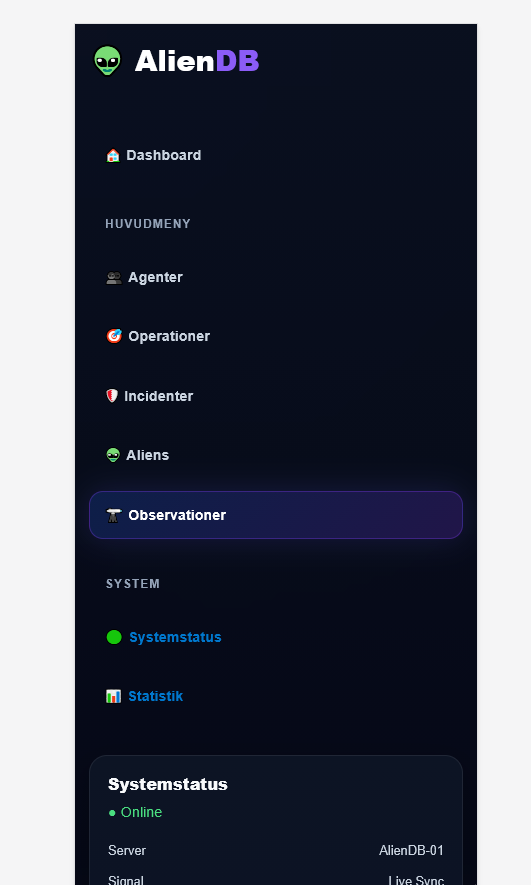

# 👽 AlienDB MVC

A fullstack project built with **ASP.NET MVC**, **C#**, and **MySQL** with focus on database design, relationships, advanced SQL, and a modern sci-fi inspired user interface.

The project demonstrates how a relational database can be integrated into a responsive MVC web application used to manage aliens, agents, operations, incidents, and observations inside a classified intergalactic database system.

---

## 🚀 Features

* 👽 Manage alien species and alien profiles (CRUD)
* 👤 Agent administration system
* 🎯 Operation management
* 🛡️ Incident tracking
* 🔭 Observation monitoring system
* 📊 Dashboard with live statistics and widgets
* 🌌 Futuristic responsive sci-fi UI
* ⚡ Animated loading screen and visual effects
* 🕒 Live clock and system status widgets
* 🔎 Search functionality
* 📱 Mobile responsive design

---

## 🧠 Database & SQL

The project contains several important database concepts:

* **Relationships (Foreign Keys)** between tables
* **Views**
  * `Vy_OperationInfo`
  * `Vy_Handlaggare`

* **Stored Procedures**
  * `LaggtillAgent`
  * `RensaGamlaOperationer`

* **Triggers**
  * Logs when operations are created or deleted

* **Constraints**
  * `UNIQUE`
  * `CHECK`
  * `NOT NULL`
  * `ENUM`

* **Indexes**
  * Performance optimization using indexes

* **Advanced relational structure**
  * Aliens
  * Alien species
  * Operations
  * Incidents
  * Observations
  * Media
  * Escape reports

---

## 🛠 Technologies

* ASP.NET MVC
* C#
* MySQL
* ADO.NET
* HTML / CSS
* JavaScript
* Bootstrap
* Chart.js

---

## 📁 Project Structure

```plaintext
Controllers/
Models/
Views/
wwwroot/
Database/
assets/
```

---

## 🎓 Context

The project was developed at **University of Skövde** during database and web development related coursework.

---

## 🎯 Purpose

The project demonstrates practical understanding of:

* Database design
* Normalization
* SQL (views, procedures, triggers)
* Backend development in C#
* MVC architecture
* Responsive web design
* Relational database systems

---

## ⚙️ Installation

1. Clone the repository:

```bash
git clone https://github.com/a24wilka/AlienDB-MVC.git
```

2. Import the database into MySQL using phpMyAdmin or MySQL Workbench

3. Open the project in Visual Studio

4. Configure your MySQL connection string

5. Run the project

---

## 📸 Screenshots

### 📊 Dashboard


### 👤 Agents


### 👽 Aliens


### 🎯 Operations


### 🛡️ Incidents


### 🔭 Observations


### 📱 Mobile View


---

## 👨‍💻 Author

**Willis Kabuye**  
GitHub: https://github.com/a24wilka
