# 👽 AlienDB MVC

A fullstack sci-fi inspired management system built with **ASP.NET MVC**, **C#**, and **MySQL**.

AlienDB MVC demonstrates how a relational database system can be integrated into a responsive MVC web application used to manage classified intergalactic information including aliens, agents, incidents, operations, observations, media channels, and escape reports.

The project focuses heavily on:

- Relational database design
- Advanced SQL concepts
- MVC architecture
- Authentication & authorization
- Responsive UI/UX
- Modern futuristic design

---

# 🚀 Features

## 👽 Alien Management
- Create, edit, search, and delete alien profiles
- Alien species, danger levels, weapons, and classifications

## 👤 Agent System
- Agent administration dashboard
- Role management
- Salary and specialization management

## 🎯 Operations
- Operation tracking system
- Operation leaders and incident connections
- Success status monitoring

## 🛡️ Incident Management
- Incident reports and regional tracking
- Search and filtering functionality

## 🔭 Observation Dashboard
- Observation monitoring system
- Security levels and threat grading

## 📡 Galactic Media Network
- Media channel management
- Propaganda risk analysis
- Active/inactive media tracking

## 🚨 Escape Reports
- Escaped alien entity reports
- Danger level monitoring
- Capture status overview

---

# 🔐 Authentication & Security

- Session-based authentication system
- Login validation
- Access denied protection
- Role-based authorization system

## Supported Roles
- Admin
- Commander
- Analyst
- Field Agent

## Security Features
- Session timeout handling
- Protected routes/controllers
- Restricted admin functionality
- Access denied page

---

# 🌌 UI / Design Features

- Futuristic sci-fi inspired interface
- Neon/glow visual effects
- Responsive layout
- Mobile-friendly design
- Animated components
- Live system clock
- System status widgets
- Dashboard statistics
- Dark mode inspired design

---

# 🧠 Database & SQL

The project demonstrates several advanced database concepts:

## Relationships & Relational Design
- Foreign Keys
- One-to-many relationships
- Normalized database structure

## Views
- `Vy_OperationInfo`
- `Vy_Handlaggare`

## Stored Procedures
- `LaggtillAgent`
- `RensaGamlaOperationer`

## Triggers
- Logs when operations are created or deleted

## Constraints
- `PRIMARY KEY`
- `FOREIGN KEY`
- `UNIQUE`
- `CHECK`
- `NOT NULL`
- `ENUM`

## Indexes
- Query optimization using indexes

## Database Modules
- Agents
- Aliens
- Operations
- Incidents
- Observations
- Media
- Escape Reports

---

# 🛠 Technologies

## Backend
- ASP.NET MVC
- C#
- ADO.NET
- MySQL

## Frontend
- HTML5
- CSS3
- JavaScript
- Bootstrap

## UI / Visualization
- Chart.js
- Custom sci-fi styling
- Responsive design

---

# 📁 Project Structure

```plaintext
Controllers/
Models/
Views/
wwwroot/
Database/
assets/
```

---

# 🎓 Academic Context

Developed at **University of Skövde** during database and web development related coursework.

The project combines practical backend development with relational database theory and responsive frontend design.

---

# 🎯 Purpose

The purpose of this project is to demonstrate practical understanding of:

- Database design
- Normalization
- SQL programming
- Stored procedures
- Triggers
- MVC architecture
- Backend development in C#
- Authentication systems
- Responsive web design
- Fullstack development
- Relational database systems

---

# ⚙️ Installation

## 1. Clone repository

```bash
git clone https://github.com/a24wilka/AlienDB-MVC.git
```

## 2. Import database

Import the SQL database into:

- MySQL Workbench
or
- phpMyAdmin

## 3. Open project

Open the solution in:

- Visual Studio

## 4. Configure connection string

Update your MySQL connection string inside:

```csharp
appsettings.json
```

## 5. Run the application

Start the project from Visual Studio.

---

# 📸 Screenshots

## 🔐 Login
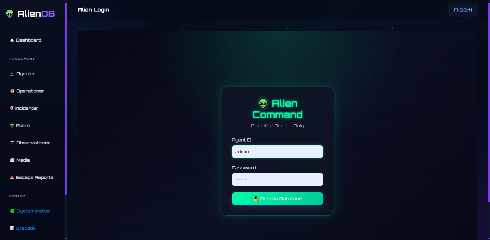

## ❌ Login Error
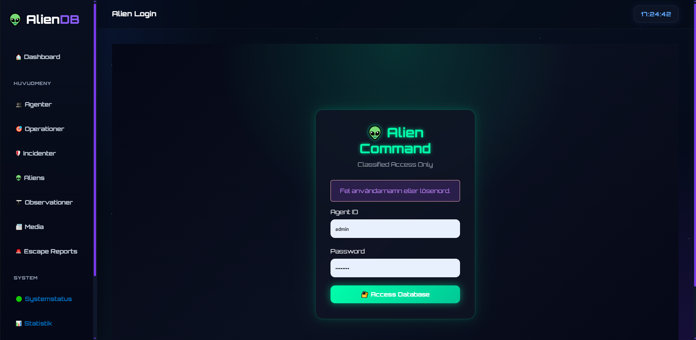

## 📊 Dashboard
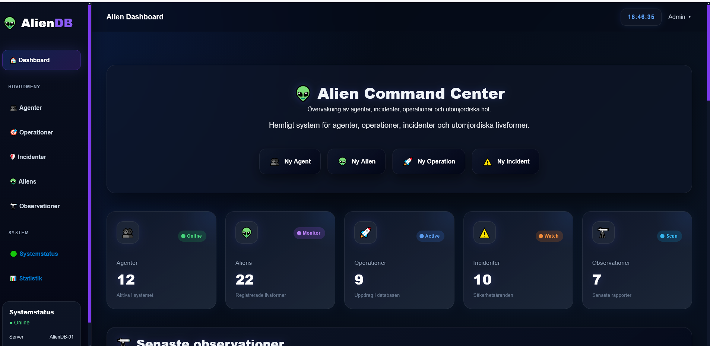

## 👤 Agents
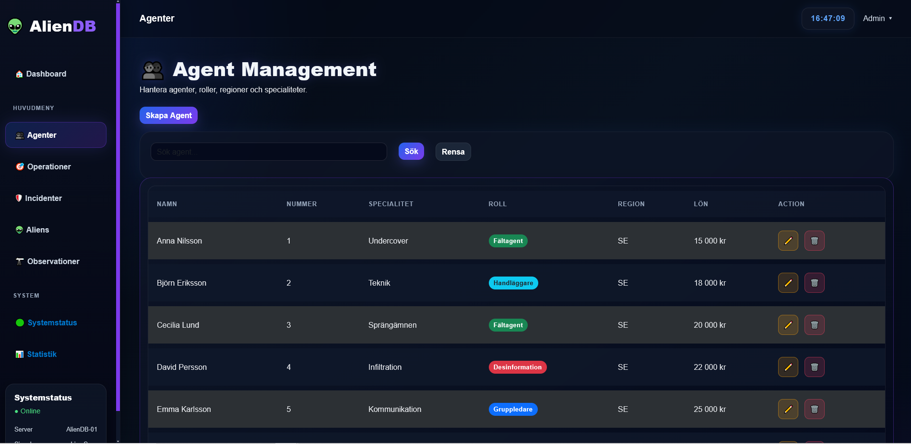

## 👽 Aliens
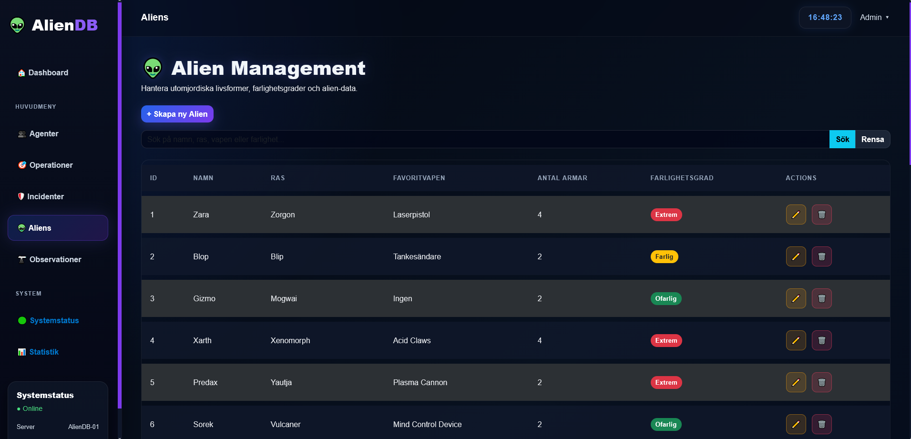

## 🎯 Operations
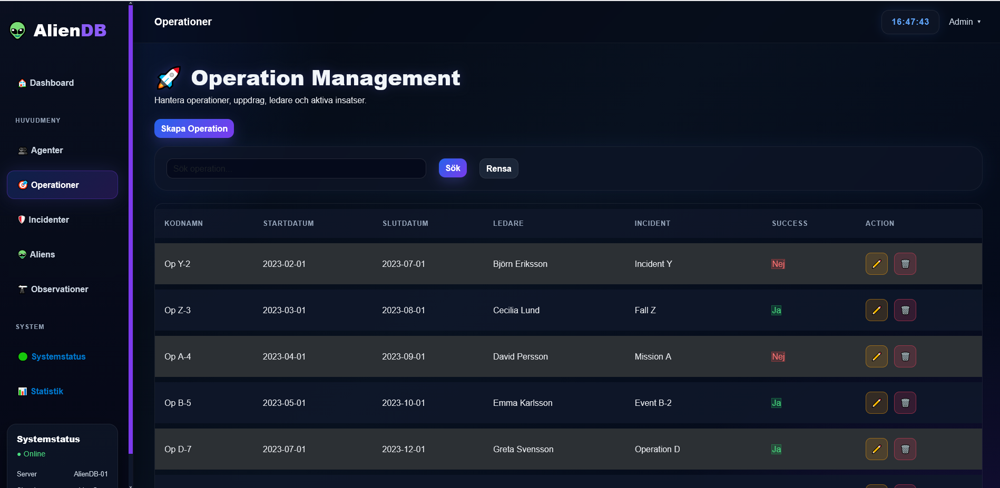

## 🛡️ Incidents
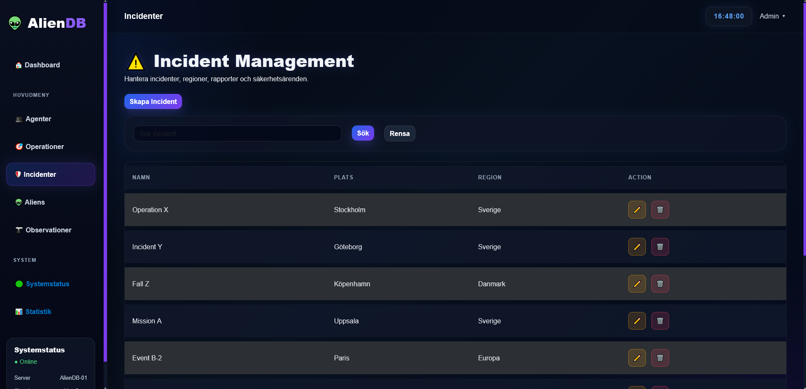

## 🔭 Observations
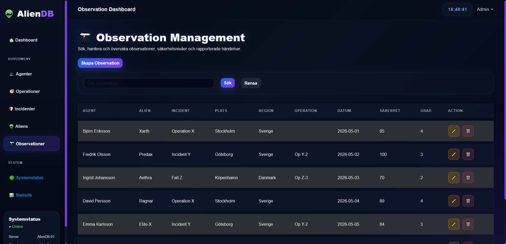

## 📡 Media
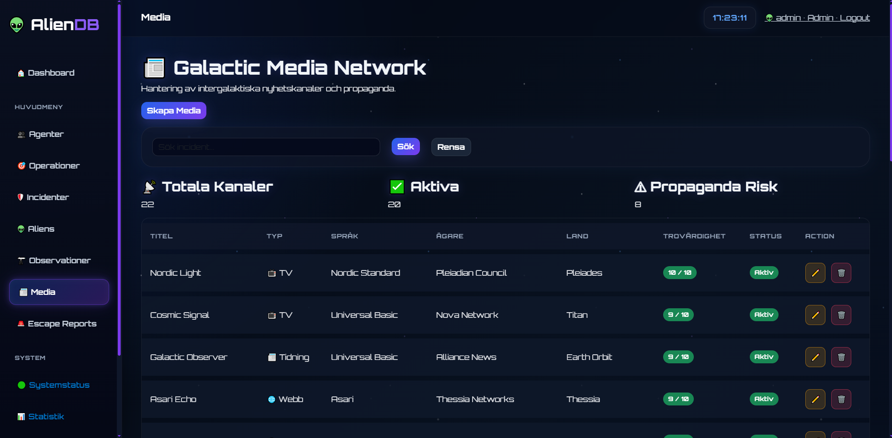

## 🚨 Escape Reports
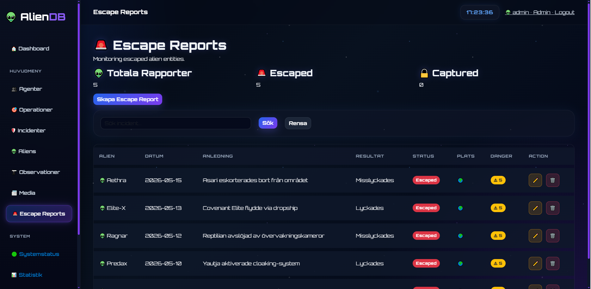

## ⛔ Access Denied
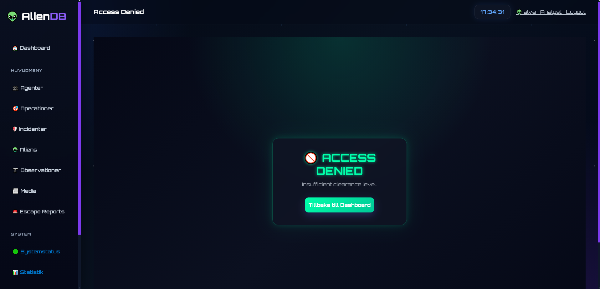

## 📱 Mobile View
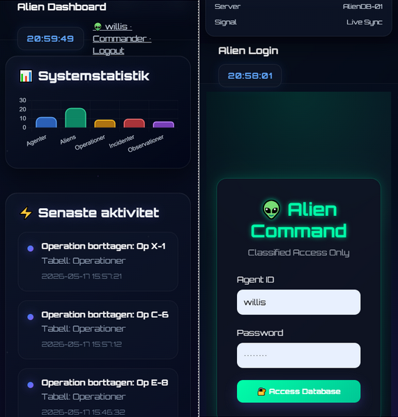

---

# 👨‍💻 Author

**Willis Kabuye**

GitHub:
https://github.com/a24wilka
